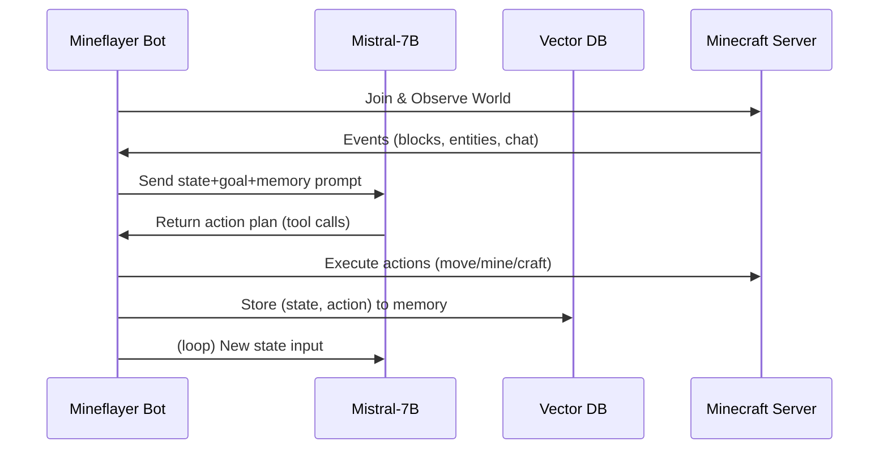

# Executive Summary  
We design **“MineAgent”**, an autonomous Minecraft AI that uses a local Mistral‐7B LLM (via Ollama) to perceive the game world, plan actions, and interact with players. The system integrates a Mineflayer bot (Node.js) for in-game control, a perception pipeline (game-state extraction ± vision), a planner using Mistral prompts and tool-calling, and a memory/RAG layer for long-term context. We fine-tune Mistral on curated Minecraft datasets (game-play trajectories, tutorial videos, wikis, Reddit) so it learns domain knowledge and policies. The architecture is fully Dockerized for production, with CI/CD for testing. Metrics include task success (e.g. craft objectives), survival time, and human-likeness of behavior. The development road­map spans Day 1 (basic bot setup) to Month 3 (trained multi-task agent). Privacy and safety are straightforward (no PII, obey Minecraft EULA), and this project highlights state-of-art AI (multimodal RL/LLM) for a standout resume.

---

## 1. System Architecture (End-to-End)  
The system consists of: 

- **Minecraft World (Java server)** – a local or LAN server running the game.  
- **Bot Interface (Mineflayer in Node.js)** – connects to the server as a player, sends commands (move, dig, craft) and receives events (chat, state updates)【4†L281-L289】.  
- **Backend API (FastAPI/Node)** – orchestrates logic: sends state to the LLM, invokes tools, and executes resulting actions via Mineflayer.  
- **Planner (Ollama Mistral-7B)** – receives structured state + task prompts, uses LLM reasoning and tool‐calling to output next actions or subgoals.  
- **Memory/Retrieval (ChromaDB/FAISS)** – stores embeddings of past states, transcripts, or external knowledge (e.g. wiki Q&A) for retrieval-augmented generation (RAG) when answering queries or planning.  
- **Optional Vision (MineCLIP/other)** – can process screen pixels or camera view to detect objects. This is optional since Mineflayer provides rich state, but can be added for multimodal tasks.  

```mermaid
flowchart LR
    subgraph Minecraft_Environment
        A[Java Minecraft Server] --> B[Mineflayer Bot (Node.js)]
    end
    B --> C[Observation Extraction]
    C --> D[Backend API / Task Planner]
    D --> E[Ollama Mistral-7B LLM]
    E -->|plan/actions| F[Action Execution (via Mineflayer)]
    F --> B
    D --> G[Memory DB (Chroma/FAISS)]
    G --> D
    D --> H[Optional: Vision Stack (MineCLIP/YOLO)]
    H --> D
```

- **State Flow**: The bot constantly observes the world (blocks, entities, inventory, etc.) via Mineflayer APIs【4†L281-L289】. These observations are converted into a structured JSON state. The Backend merges this with any retrieved memory or context and prompts Mistral. The LLM’s output (a plan or specific actions) is then parsed: if it calls a “tool” (e.g. `move`, `craft`), the backend executes it via Mineflayer.
- **APIs & Tools**: We expose internal actions as tools (functions) to the LLM. For example, tools like `get_inventory()`, `move(direction, steps)`, `mine(block)`, `craft(item)`, `chat(message)` can be defined. Mistral uses function-calling (via Ollama’s REST API【27†L102-L108】) to invoke them. Example: Mistral sees JSON state and outputs `move("north", 10)`.
- **Front-end (optional)**: A minimal UI (web dashboard) can visualize bot’s POV or command/status, but for Day 1 focus is headless.  

**Example Tool Integration:**  
```python
# Python pseudo-code: exposing Move tool
def move_tool(direction: str, distance: int) -> str:
    # calls Mineflayer’s pathfinder via WebSocket or direct binding
    bot.pathfinder.setGoal(new GoalMoveTo(player.position.offset(direction, distance)))
    return "Moving " + direction
```
Mistral might be prompted: 
```json
{"inventory": ["wood", "stone"], "health": 18, "goal": "build shelter"}
```
and respond with: 
```json
{"action": "move", "direction": "north", "distance": 10}
```  
The backend executes `move_tool("north", 10)`.

## 2. Perception Pipeline (Game-State Extraction)  
We extract all relevant state from Mineflayer:

- **Player Stats:** health, hunger, position, biome, time of day.  
- **Inventory:** items and quantities.  
- **Equipped item/armor:** what the bot has selected or worn.  
- **Nearby Entities/Blocks:** List of visible blocks (type, distance) and entities (mobs, players, animals) within a radius.  
- **World Info:** e.g. current coordinates of important locations (spawn point, village), weather. Mineflayer can query blocks around the bot rapidly【4†L281-L289】.  

This raw state is converted into a JSON schema like:  
```json
{
  "health": 20,
  "inventory": {"oak_log": 12, "stone": 5, "iron_ore": 3},
  "position": {"x": 105.4, "y": 64, "z": -217.2},
  "nearby_blocks": [
    {"type":"oak_tree", "distance":7},
    {"type":"stone", "distance":4}
  ],
  "nearby_entities": [
    {"type":"cow", "distance":10},
    {"type":"zombie", "distance":15}
  ],
  "time": "day",
  "goal": "find food"
}
```
This state is supplied to Mistral as part of the prompt. Optionally, we can attach sensory data (e.g. screenshots) to a vision model (like MineCLIP) to get additional descriptions, but even without vision, the structured state is sufficient for reasoning.

## 3. Action Execution (Mineflayer Tools)  
All actions are carried out via Mineflayer/Prismarine APIs【4†L281-L289】:

- **Movement:** `bot.setControlState('forward', true)`, or using the `mineflayer-pathfinder` plugin to pathfind to coordinates (supports `GoalFollow`, `GoalBlock`).  
- **Mining/Digging:** `bot.dig(block)` for a block reference.  
- **Crafting:** `bot.craft(recipe, count, craftingTable)` to craft items.  
- **Inventory:** e.g. `bot.transfer(itemToBlock, quantity)` to move items between inventory and chests.  
- **Chat/Interact:** `bot.chat("Hello!")` or `bot.activateBlock()` for doors/switches.  

Each of these is wrapped so the LLM can “call” them via a function API. This mapping can be implemented via Ollama’s function-calling or simply by parsing the LLM’s response JSON. For example, if Mistral’s chat response is  
```json
{"tool": "mine", "args": {"block": "iron_ore"}}
``` 
we route that to `bot.dig(iron_ore_block_ref)` in the code.  

Pathfinding ensures safe navigation (avoiding lava, mobs). We set up default `Movements` in Mineflayer so the bot can handle walking, jumping, etc.  

## 4. Memory & Retrieval (ChromaDB)  
To give the agent long-term memory and RAG capabilities, we use a vector DB (e.g. ChromaDB). We index: 

- **Previous Episodes:** Key states or events (e.g. “killed zombie at X”).  
- **Transcripts/Q&A:** Snippets from YouTube transcripts, wiki tips, Reddit Q&As about Minecraft tasks.  
- **Learned Recipes/Instructions:** e.g. embedding of “To make bread: get 3 wheat” from wiki.  

When Mistral is planning, we retrieve similar entries to the current query. For instance, if the bot’s goal is “build a house”, we might retrieve a Wikipedia box of “house recipe” or a Reddit answer about house-building. The retrieved text is added to the prompt as context. This is akin to “Memory” in RAG-based agents【6†L83-L92】.  

**Schema Example (Chroma):** each memory entry can store a JSON like:  
```json
{
  "id": "mem42",
  "chunk": "Player says: To build a house, first gather wood.", 
  "embedding": [0.12, -0.34, ...] 
}
```  
We embed text (transcripts/wiki) with an LLM embedding model (or MineCLIP). At planning time, do a cosine search on semantically similar memory to include as examples in prompt (In-Context Learning)【6†L83-L92】.

## 5. Planner/LLM Integration (Ollama Mistral-7B)  
We run **Mistral 7B** locally via Ollama. Ollama exposes a REST API by default at `http://localhost:11434/api`【27†L87-L95】. Example (assuming Ollama server is running):  
```bash
curl -X POST http://localhost:11434/api/chat -d '{
  "model": "mistral-7b-v3",
  "messages": [{"role":"system","content":"You are a Minecraft agent."},
               {"role":"user","content":"State: ... What do you do next?"}]
}'
```  
The example in Ollama docs shows generating via `/generate`【27†L102-L108】, but we would use `/chat` for conversation or planning with system/user roles. The response is the agent’s answer (e.g. move commands or plan steps).

**Prompt Engineering:** We design templates such as:  
```
You are a helpful Minecraft agent. 
Current state: <JSON_STATE>. 
Memory/context: <retrieved_info>. 
Goal: <task>. 
Plan your next actions as a JSON list of tool calls.
```
Including retrieved context helps grounding.  

**Function/Tool Calling:** Mistral supports function calling (via Ollama’s tool API)【24†L63-L72】. We define a JSON schema of available actions (move, dig, craft, chat, etc.). The LLM can output a function call which Ollama returns as structured JSON.  

For example, we might define:  
```json
"tool": "move", "args": {"direction": "north", "steps": 10}
```  
Ollama can be configured to parse this schema and we execute corresponding Mineflayer API.  

**Streaming:** Ollama also supports streaming responses【27†L102-L108】. For longer plans (multi-step), we stream partial results and execute sequentially, updating the world state after each.  

**Safety/Filtering:** We add checks: any generated action is validated (e.g., target blocks exist, commands are allowed). We strip or reject any out-of-scope content (curse words, etc.) since the model is self-contained.

## 6. Training Data & Datasets  

We curate several sources for fine-tuning:  

| Source                | Content                                 | Size / Notes                           | Citation            |
|-----------------------|-----------------------------------------|----------------------------------------|---------------------|
| **MineRL**            | Human game-play trajectories           | 500+ hours, ~~60M state–action pairs~~【19†L253-L260】 (64×64px low-res) |【19†L253-L260】      |
| **MineDojo YouTube**  | Minecraft video transcripts (narrations) | 730K+ videos (~300K hours), 2.2B words【13†L54-L60】 |【13†L54-L60】       |
| **MineDojo Reddit**   | r/Minecraft Q&A posts                  | 340K posts, 6.6M comments【16†L472-L480】 |【16†L472-L480】      |
| **Minecraft Wiki**    | Wiki pages (recipes, instructions)     | 7K pages scraped (text + tables)【16†L472-L480】 |【16†L472-L480】 (implied) |
| **OpenAI VPT vids**   | Unlabeled gameplay videos             | 70K hours (foundation data)【10†L50-L57】 |【10†L50-L57】       |
| **Custom Demos**      | Recorded via Mineflayer plugin        | ~10–100h (as needed) of desired tasks    | —                   |

- **MineRL (Human Demos):** Well-formatted state-action logs. We use their JSON to train behavior cloning. Each state includes inventory, view, etc. The [19] dataset is ideal for low-level policies.  
- **MineDojo YouTube (Transcripts):** Rich natural language about tasks. We can fine-tune Mistral on (question→answer) pairs extracted from these transcripts, or use them to augment the model’s vocabulary of game actions (using them as in-context examples of behavior descriptions). For instance, take a segment “I’m going to build a castle” as an example of high-level planning language.  
- **Reddit & Wiki (Textual Q&A):** We fine-tune Mistral on wiki Q&A or Reddit posts formatted as instruction-response. E.g., (Q: “How to build a Nether portal?”, A: “You need obsidian…”) as additional expertise. Mistral gains domain knowledge【16†L472-L480】.  
- **OpenAI VPT (Videos):** We don’t fine-tune Mistral on raw video, but we can use VPT’s idea: train an inverse dynamics model to label raw video (transcripts + predicted actions) to augment datasets. However, on limited hardware, simpler: scrape YouTube captions and align with MineRL states if possible.  

**Data Format for Fine-tuning:** We structure fine-tuning data as JSON records, e.g.:  
```json
{"state": {"inventory": {"log":5}, "nearby_entities":["cow","pig"], "goal":"make bread"},
 "actions": ["gather wheat", "craft bread"]}
```  
or for question-answer style:  
```
Q: Given state { ... }, what should agent do? 
A: ...
```  

We’ll convert MineRL logs to (state→action) by aggregating primitive actions into higher-level “intent” when possible.  

**Dataset Comparison:** The table above shows the diversity of sources (vision transcripts vs. direct play logs) and sizes. This combination ensures the model learns both *how to act* (from demos) and *what to do and why* (from text knowledge)【13†L54-L60】【19†L253-L260】.

## 7. Fine-Tuning Strategy (Mistral 7B)  

We fine-tune using **LoRA/QLoRA** techniques on our hardware (Ryzen 7, 16GB RAM, 4GB GPU)【22†L284-L292】:

- **Adapter Training (LoRA/QLoRA):** Freeze 98–99% of Mistral’s weights and train only low-rank adapters. Use 4-bit quantization (QLoRA with bitsandbytes) to reduce GPU memory. The [22] guide confirms 7B models can be fine-tuned on a single GPU with LoRA【22†L284-L292】.  
- **Framework:** Use Hugging Face Transformers + BitsAndBytes + PEFT + Accelerate.  
- **Hyperparameters:** LR ≈1e-5–1e-4, batch size small (e.g. 4–8), seq_len ~512 (enough for state+instructions). We may use gradient accumulation to simulate larger batches. For 7B, even 4-bit requires ~6–8GB VRAM, so we do tensor offloading to CPU or gradient checkpointing to fit in 4GB if needed.  
- **Instruction Tuning:** Format each example as instruction→response. For state-action, we might instruct: “Given this state, output the next action.” For wiki Q&A, use question→answer format.  
- **Mixing Data:** We likely do multi-stage tuning: first fine-tune on textual Minecraft knowledge (wiki, Reddit) to specialize Mistral’s domain understanding, then further fine-tune on state-action pairs (behavior cloning) to teach policies.  
- **Compute Constraints:** With only 16 GB RAM, we might do fine-tuning on CPU (via CPU offloading in `accelerate`) or use a small cloud GPU for initial tuning (if feasible). But since LoRA is small, local fine-tuning is possible with careful resource use.  
- **Tools:** The official `mistral-finetune` repository (LoRA-based) is recommended【22†L284-L292】. It expects JSONL format: `{"input": "...", "target": "..."}`. We will craft inputs that include the JSON state or question, and targets as the correct JSON action or explanation.

**Example Training Record (JSONL):**  
```json
{"input": "State: {\"inventory\":{\"log\":4,\"wheat\":3}, \"nearby_entities\":[], \"goal\":\"make bread\"}\nAgent action:", 
 "target": "Gather 3 wheat, then craft bread by interacting with a crafting table."}
```  

This way, Mistral learns to map state+goal to actions (behavior cloning with language output). We can also fine-tune it to answer Q&A (e.g., "How do I brew potions?" → answer).

## 8. Evaluation & Testing  
We evaluate on multiple criteria:

- **Task Success Rate:** For benchmark tasks (e.g. from MineDojo or custom tasks), measure % of tasks completed. For example, “make a crafting table” or “collect food” from scratch.  
- **Survival/Progress:** How long can the agent survive without commands or how far does it explore? (Inspired by AI safety/auto agent benchmarks).  
- **Human-likeness:** Present logs to human judges or compare statistical features (entropy of actions) versus human play.  
- **Key Metrics:** Number of objectives achieved, time to objective, # actions taken, etc.  
- **Automated Tests:** We build scripted scenarios (e.g., spawn sheep, see if agent tries to gather wool) and assert expected behavior. This can be part of CI.  
- **Performance Monitoring:** Log LLM latency (<500ms target for responsiveness). Use monitoring (Prometheus) to track calls per second, error rates.  

For creative tasks, we can adopt MineCLIP’s evaluation: e.g. have a reward model that scores the agent’s outputs against desired outcomes (like building tasks), as they did in MineDojo【16†L472-L480】.

## 9. Development Roadmap & Milestones  

| Timeline    | Milestone                                    | Description                            |
|-------------|----------------------------------------------|----------------------------------------|
| **Day 1**   | **Basic Bot Setup**                          | - Install Java, Node.js, Minecraft server. <br>- `npm init; npm install mineflayer`. <br>- Write simple bot that connects and echos chat【4†L281-L289】. <br>- *Commands:* `node bot.js` joins world. |
| **Week 1**  | **Basic Actions**                            | - Enable movement: `bot.setControlState('forward', true)`. <br>- Install `mineflayer-pathfinder` for navigation. <br>- Bot follows player command (“follow me”). <br>- Chat integration: simple Q&A responses. |
| **Week 2**  | **State Extraction & Prompting**             | - Extract inventory, health, nearby blocks/entities via Mineflayer APIs. <br>- Format state JSON. <br>- Integrate Ollama: run `ollama run mistral-7b`. <br>- Test simple prompt-response. |
| **Week 3**  | **Action Tools & Planning Loop**             | - Define tools (move, mine, craft) and tool-calling schema. <br>- Prompt Mistral to output JSON actions. <br>- Connect output to Mineflayer commands. <br>- Loop: Observe → Plan → Act → Observe. (Mermaid agent loop below). |
| **Month 1** | **Memory & RAG**                             | - Set up ChromaDB. Index sample transcripts (wiki, reddit). <br>- Implement retrieval: given a query (goal), fetch top-k relevant memories. <br>- Include memory text in prompts. |
| **Month 2** | **Data Collection**                          | - Gather additional data: record Mineflayer-play via plugin for custom tasks. <br>- Use MineRL/MineDojo datasets. Prepare JSONL for fine-tuning. |
| **Month 3** | **Fine-Tuning and Refinement**               | - Fine-tune Mistral (LoRA) on our dataset. <br>- Evaluate and iterate. <br>- Add advanced features: persona, voice (Whisper/TTS). <br>- Polishing, Dockerize whole stack. |



## 10. CI/CD, Deployment & Infrastructure  

- **Containerization:** We pack the components into Docker containers:  
  - **Minecraft Server Container** (Java).  
  - **Mineflayer Bot Container** (Node.js) that connects to the server.  
  - **Backend/LLM Container** (Python) running Ollama. We can even use an Ollama-provided Docker image.  
  - **DB Container** (Chroma or PostgreSQL for logs).  
- **Local vs Cloud:** For development and demos, run everything locally. For heavy training (if needed), we could use a cloud VM with GPU (AWS, GCP) temporarily. Table:  

  | Component        | Local Feasible?    | Cloud Option                    |
  |------------------|--------------------|---------------------------------|
  | **Minecraft MC** | Yes (dedicated server) | N/A (runs anywhere)          |
  | **Mineflayer Bot**| Yes (Node.js, 16GB RAM) | Yes                          |
  | **Ollama Mistral**| Yes (llama-7B with GPU/CPU) | Yes (prefer GPU for speed)  |
  | **Fine-Tuning**  | Very limited (CPU only, 16GB) | Yes (GPU instance)         |
  | **Vector DB**    | Yes (Chroma, ~few GB)   | Yes (managed DB)             |
  
  Fine-tuning 7B on 4GB GPU is extremely tight; likely offload to CPU or cloud GPU. But inference (Ollama serving) can run on CPU if latency allows (~1-2s per query). 

- **CI/CD Pipeline:** Use GitHub Actions: On commit, spin up a mini server, run unit tests (e.g., bot responds to chat, LLM returns a valid JSON for a test state). Use `docker-compose` for integration tests.  
- **Monitoring:** Log all LLM calls and actions. Check for failures (failed pathfinding, exceptions). Monitor latency of prompts and actions.  

## 11. Ethical, Safety & Legal Considerations  
- **Minecraft EULA & Mods:** Running a local bot on a single-server is allowed (no monetization). We avoid anything that gives unfair advantages on public servers.  
- **Data Licensing:** All used data (MineRL, MineDojo) is publicly available and cite their sources (we do not scrape copyrighted content). Videos transcripts are publicly available from YouTube.  
- **User Interaction:** The agent’s chat output must be non-toxic. We add filters if necessary (bot should not produce profanity or malicious commands).  
- **Privacy:** No personal data; just game state.  
- **AI Safety:** The agent should not exhibit unsafe behaviors (e.g. it won’t harm players). We avoid RL reward hacking by using only permissive learning.  
- **Transparency:** In a demo, we’ll note “AI-powered agent” so humans know it’s not another human.  

## 12. Resume-Friendly Highlights  
This project showcases:  
- **Multimodal AI** (LLM + game engine interface).  
- **Embodied Agent Design** (State→Action planning loop).  
- **Use of Cutting-edge Models** (fine-tuned Mistral-7B on unique domain data).  
- **Integration of Open Data** (MineRL, MineDojo datasets) to bootstrap learning【13†L54-L60】【19†L253-L260】.  
- **Memory & RAG Techniques** (persistent memory database).  
- **Full-Stack Deployment** (Node.js + FastAPI + Docker + Ollama).  
- **Tool Use / Function Calling** in LLM, a trending paradigm【24†L63-L72】.  
- **Algorithmic Complexity** (planning and learning in a complex 3D environment).  
- **Ethical AI** (we carefully manage data usage and user safety).  

Altogether, **MineAgent** is an advanced AI project blending game AI, LLMs, and RL concepts, making it a highly impressive portfolio piece.

