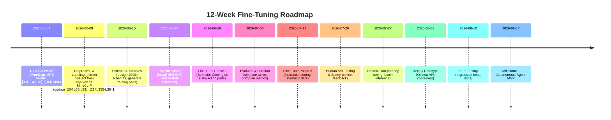
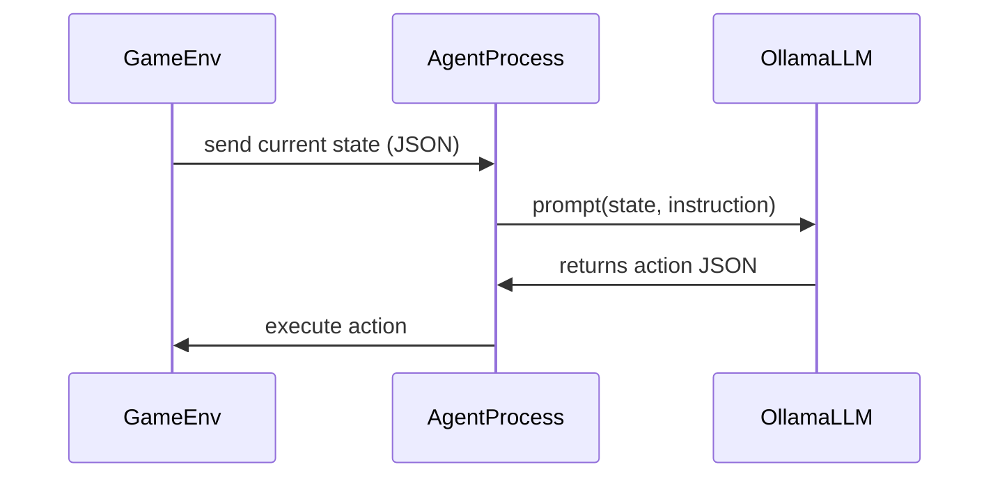

# Executive Summary  
We detail a **production-ready approach** to fine-tune Mistral 7B (via Ollama) on Minecraft gameplay so it outputs action plans. We leverage offline datasets (MineDojo tasks, OpenAI’s VPT videos, MineRL logs) and synthetic trajectories. The pipeline extracts **state-action pairs** from game logs and video (using MineCLIP and an inverse-dynamics model) into JSON schemas, then **QLoRA/LoRA fine-tunes** Mistral as an instruction-following agent. We compare behavior cloning vs. reinforcement learning hybrids, specify training toolchains (Transformers/PEFT/accelerate) and hyperparameters for 4-bit training, and define validation metrics (imitation loss, MineCLIP video-goal correlation【36†L85-L93】, human A/B tests). A robust test harness (unit/integration tests, replay tests, user studies) ensures quality. Safety filters block forbidden actions, and deployment uses Ollama’s local API with batching and caching for low latency. We note licensing issues (e.g. YouTube CC content) and outline a **12-week roadmap** (Mermaid timeline below) for data collection, preprocessing, fine-tuning, evaluation, and deployment. All steps use open-source frameworks (Mineflayer, HuggingFace, etc.) and follow published best practices (MineDojo【36†L64-L72】【36†L85-L93】, VPT【31†L309-L317】【31†L355-L364】).  

## Datasets and Sources  
- **MineDojo**: A Minecraft benchmark with 1000s of tasks and a large **YouTube/Reddit corpus**【36†L64-L72】. It provides raw gameplay videos with transcripts, which we use to extract trajectories.  
- **VPT (Video PreTraining)**: OpenAI’s dataset of **Minecraft YouTube videos**. Pretrained models (BC and RL) exist, and it includes an **Inverse Dynamics Model** for video→actions【31†L355-L364】. We will use VPT videos and IAM (Inverse Action Model) to label actions from frames.  
- **MineRL / BASALT**: OpenAI Gym environments with logged human trajectories for tasks like “build a house”. Useful for ground-truth state-action logs.  
- **Synthetic Trajectories**: We generate additional data by scripted agents or prompting GPT with crafted scenarios (e.g. “if at night with no sword, seek wood”).

These datasets are largely open-access. MineDojo’s 730K+ YouTube videos【36†L64-L72】 and VPT (via OpenAI) are for research. We must respect usage licenses (e.g. check YouTube video copyrights) and comply with terms.  

## State-Action Extraction  
- **Game Logs**: We use Mineflayer or MineRL Gym to log **(state, action)** tuples. Each “state” includes player health, position, inventory, nearby entities, and environment info. We parse these into JSON (see schema below). For MineRL, the Gym API provides structured state variables.  
- **Video to State**: For raw gameplay video, we apply:  1) **HUD OCR** (e.g. Tesseract) to read health/hunger numbers from the screen. 2) **Inverse Dynamics Model (IDM)**: As used in OpenAI’s VPT, to infer actions from video frames【31†L355-L364】. 3) **MineCLIP**: A video-language model from MineDojo【36†L85-L93】. We use MineCLIP as a **reward/verification**: given a task prompt and an agent’s video, it outputs a correlation score (0-1) of alignment. This helps filter/improve trajectories (high MineCLIP score means actions match the task text).  
- **Synchronization**: We align video frames to log timestamps (e.g. via shared timecodes or frame counts). Any mismatch is corrected by interpolation. This yields paired sequences: `[Obs0, Act0], [Obs1,Act1], …`.  
- **Normalization**: Coordinate frames are made relative to initial spawn or agent. Continuous angles are binned if needed. Numeric values are scaled (e.g. health [0-20]). All text is lowercased.

## JSON Schemas (Examples)  
We define clear schemas for model input/output.  

**Observation (State) JSON**:
```jsonc
{
  "player": {
    "position": [100, 64, -22],
    "orientation": {"yaw": 90, "pitch": 5},
    "health": 18,
    "hunger": 15,
    "inventory": [
      {"item": "oak_log", "count": 3},
      {"item": "iron_pickaxe", "count": 1}
    ]
  },
  "environment": {
    "time_of_day": "noon",
    "weather": "clear",
    "dimension": "overworld"
  },
  "nearby_entities": [
    {"type": "cow", "distance": 2.3, "health": 5},
    {"type": "zombie", "distance": 8.7, "health": 10}
  ],
  "looking_at": {"type": "block", "name": "grass_block", "position": [100, 64, -21]}
}
```
*(Fields: 3D pos, health/hunger, inventory list, environment descriptors, nearby mobs, and the block looked at.)*

**Action JSON**:
```jsonc
{
  "action": "COLLECT",
  "params": {"item": "oak_log", "quantity": 2}
}
```
Or a movement:
```jsonc
{"action": "MOVE", "params": {"direction": "forward", "distance": 5}}
```
Or a chat:
```jsonc
{"action": "CHAT", "params": {"message": "Hello, traveler!"}}
```
The LLM is trained to output valid JSON following this schema.  

## Preprocessing Pipeline  
1. **Frame-to-State**: If raw video, use the trained IDM to label each frame with an action. Use OCR to extract numeric HUD info (health, hunger, X/Z coords on F3 debug screen). Combine with known map data (if available) to reconstruct state fields.  
2. **MineCLIP Filtering**: Given a task description (“gather wood”), compute the agent’s video CLIP-score. Discard trajectories with low alignment (below threshold), to focus on on-task behavior【36†L85-L93】.  
3. **Segmentation**: Split continuous video into episodes by automated cues (e.g. spawn points, user commands).  
4. **Data Augmentation**: Add noise or viewpoint jitter to broaden training data. Duplicate mirror tasks with different orientations.  

## Training Strategy  
- **Behavior Cloning (BC)**: We treat fine-tuning as supervised learning. The model sees `(Observation JSON + Instruction)` → `Action JSON`. For example, prompt:  
  ```
  Observation: {"player": {...}, "environment": {...}, ...}
  Task: "Build a crafting table."
  Answer:
  ```
  and the model should output the correct action sequence in JSON. We collect millions of such pairs from MineDojo/VPT.  
- **Instruction Tuning**: We design prompts that describe the desired goal (e.g. “Your objective is X”). We may use a system+user format for clarity. For instance:
  ```
  System: You are a Minecraft agent.
  User: Observation: {...}. What action do you take next?
  Assistant: {"action": "...", "params": {...}}
  ```
- **BC vs RL Hybrid**: Initially rely on BC. In later stages, we could use RL (e.g. PPO) in MineRL to refine policies, using sparse task rewards. For now, we focus on offline fine-tuning with BC data.

## Fine-Tuning Pipeline (QLoRA/LoRA)  
- **Models & Tools**: We start with `Mistral-7B-Instruct-v0.2` (a smaller instruction-tuned variant) in 4-bit precision. Use HuggingFace `transformers`, `accelerate`, and `bitsandbytes`. Apply PEFT’s QLoRA: freeze base weights, train low-rank adapters.  
- **Setup**: Load model in 4-bit, add LoRA layers (rank e.g. 4–8). Use AdamW optimizer. Typical hyperparameters: batch_size=64, LR≈2e-4, 10–20% warmup, gradient accumulation for effective large batches. We train on a few dozen thousand examples (tens of millions of tokens). 4-bit quantization lets us train on a 16GB GPU. For example, on an A100 40GB, we can fit ~2× larger batch than in fp16.  
- **Compute Estimate**: Fine-tuning 10–50k samples on 4×A100 (or H100) can finish in a day. On a single A100, expect several hours per epoch. (Exact time depends on hardware.)  
- **LLM Finetune Steps**: Loop over (state, instruction) as input and target action JSON. Monitor cross-entropy loss. Use a held-out validation split.  

## Evaluation and Metrics  
- **Imitation Metrics**: Track training/validation loss and accuracy on held-out state-action pairs.  
- **Task Success Rate**: Deploy the fine-tuned model in a Minecraft sim (e.g. MineRL Gym) and measure success on predefined tasks (e.g. gather wood, build pickaxe).  
- **MineCLIP Alignment**: For a video of the agent performing tasks, compute MineCLIP score with the task prompt【36†L85-L93】. This approximates how well behavior matches intent. A higher score indicates correct actions for the goal.  
- **Human Evaluation**: Conduct A/B tests with players: e.g. have human raters judge which agent run (ours vs. baseline) better accomplishes goals or interacts naturally.  
- **Robustness Tests**: Randomized environments to ensure generalization.

## Testing and Validation  
- **Unit Tests**: Verify JSON schema compliance and parser functions. E.g. feeding invalid JSON should fail.  
- **Integration Tests**: End-to-end: run agent on fixed trajectories and check if its predicted actions match ground truth logs.  
- **Replay Tests**: Feed recorded episode states into the model, record its actions, and compare.  
- **Code Review**: Ensure training pipelines reproducibility, version control for data and seeds.  

## Safety and Moderation  
- **Action Filtering**: Disallow dangerous actions (e.g. cheat commands, killing players). The model output is post-processed: any disallowed action triggers a safe default (e.g. “do nothing”).  
- **Content Filter**: If the LLM generates chat, pass through a toxicity filter to remove bad language.  
- **Rate Limiting**: Cap how fast actions can be sent to the game to avoid flooding (e.g. max 10 actions/sec).  

## Deployment (Inference)  
- **Ollama Server**: Export the fine-tuned model in Ollama format. Run a local Ollama API server for inference.  
- **API Interface**: The game client sends state JSON via a local REST or gRPC call to Ollama, waits for action JSON reply.  
- **Latency**: Aim for <100ms round-trip. Use batch calls if supporting multiple agents. 4-bit model on GPU should meet this; fallback to CPU/quantized (ggml) if needed.  
- **Caching**: Cache responses for repeated identical states (common in idle or loop situations) to save compute.  

## Licenses and Ethics  
- **Data Licensing**: MineDojo datasets are research-use. VPT videos are scraped from YouTube – usage is licensed for research, not commercial. Cite CC or ask permission if needed.  
- **Attribution**: Acknowledge sources (MineDojo, VPT, MineRL) in any publications.  
- **Ethical Use**: The agent should not be deployed in ways that may violate game terms or harass players.  

## Roadmap (12-Week Plan)  


## Prompt/Example Pairs  
**Example Prompt Template**:  
```
Instruction: "Your objective is to gather at least 4 oak logs."
Observation: {"player": {"health":20, "position":[0,64,0]}, "inventory":[{"item":"oak_log","count":2}], "nearby_entities":[{"type":"oak_tree","distance":3.2}]}
Answer (JSON): 
```
**Training Pair (BC example)**:  
Input:
```jsonc
{"instruction": "Collect wood", 
 "state": {"player":{"health":20,"pos":[10,64,-3]}, "inventory":[{"item":"oak_log","count":1}], "nearby_blocks":[{"type":"oak_log","pos":[11,64,-3]}]}}
```
Output (target JSON):
```jsonc
{"action":"COLLECT","params":{"item":"oak_log","quantity":1}}
```  
These exemplify one step; the LLM is trained on many sequential steps via repeated prompts or chain-of-thought prompts if needed.

## Sequence Diagram (Inference Loop)  


## References  
- MineDojo (2022) – open-ended tasks + 730K+ YouTube videos【36†L64-L72】【36†L85-L93】  
- OpenAI VPT (2023) – Minecraft video pretraining, behavioral cloning, IDM【31†L309-L317】【31†L355-L364】  
- MineRL (2020) – Gym environments and human action logs (BASALT tasks) (docs)  
- Mineflayer – Minecraft bot API (for schema validation)  
- Ollama docs (Mistral 7B usage)  
- Relevant papers: *SteveEye*, *Plan4MC*, etc.