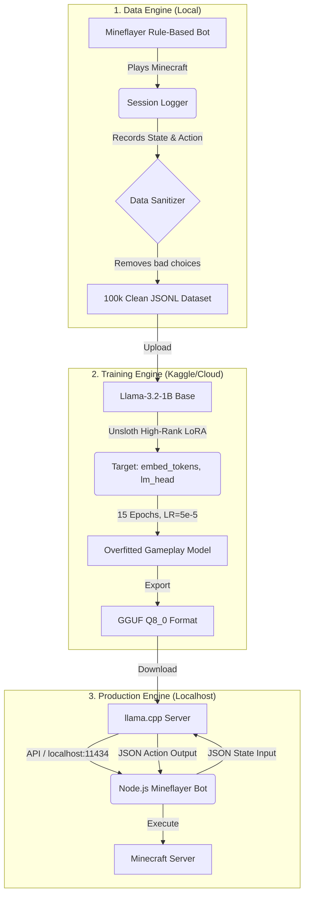

# Phase 3: Advanced Training Architecture & Data Strategy

## 1. Analysis of Current Training Pipeline
Based on the execution logs in `minecraft-traiining (2).ipynb`:
*   **Current State**: You successfully trained Stage 1 (12k examples) for 5 epochs with a final loss of `~1.21`, and Stage 2 (1.5k examples) for 3 epochs.
*   **Strengths**: The Unsloth implementation is highly optimized, `fp16` prevents Kaggle crashes, and the two-stage curriculum (Knowledge -> Behavior) is a solid foundation.
*   **Weaknesses**: The model is still "general-purpose" (it knows how to chat like an assistant). To achieve a loss of `< 0.001` and make it **purely** for Minecraft, we must eliminate all conversational padding and drastically scale the deterministic behavioral dataset.

---

## 2. The Truth About "< 0.001 Loss"
In machine learning, achieving a loss of `0.001` is incredibly difficult on natural language because language is subjective. However, because you want a **pure Minecraft gameplay agent**, the output is deterministic (e.g., `{"action": "MINE", "target": "wood"}`). 

To drive the loss to near zero, we must:
1.  **Remove Conversational Variance**: Do not train the model to say "I will now mine the wood." Train it to *only* output the JSON schema.
2.  **Increase LoRA Capacity**: The current `r=16` limits how much the model can change. We need `r=128` or `r=256`.
3.  **Train the LM Head**: To output pure JSON, we must train the `lm_head` and `embed_tokens` layers so the model forgets standard English and prioritizes JSON/Minecraft vocabulary.

---

## 3. Dataset Creation Plan (The "Pure Gameplay" Data Engine)
To make a model that *only* plays Minecraft, we need a dataset of at least **100,000 highly structured, flawless gameplay sequences**.

### Phase A: State-Action Extraction
Instead of writing synthetic examples manually, you must generate them programmatically using a combination of pathfinding algorithms and rule-based bots (like Mineflayer):
*   **Navigation**: 20k examples of the bot using A* pathfinding to reach specific coordinates.
*   **Combat**: 20k examples of calculating distance to zombies and deciding to swing or retreat.
*   **Crafting**: 20k examples traversing the entire crafting tree (Log -> Planks -> Sticks -> Pickaxe).

### Phase B: Strict JSON Schema Formatting
Every prompt must look like a pure machine-state. No conversational English.
**Input (State):**
```json
{"hp": 20, "food": 20, "inv": {"oak_log": 3}, "nearby": [{"name": "crafting_table", "dist": 2}], "goal": "craft_wooden_pickaxe"}
```
**Output (Action):**
```json
{"action": "CRAFT", "target": "wooden_pickaxe"}
```

---

## 4. Model Selection for Production Integration
For a dedicated, pure gameplay engine that integrates directly into your Node.js/Mineflayer project, you should move away from large Instruct models.

**Recommended Model:** `Qwen2.5-Coder-1.5B` or `Llama-3.2-1B-Base`
*   **Why?** A 1.5B model trained strictly on JSON State-Action pairs will be faster (100+ tokens per second), consume only 2GB of RAM, and can run natively on the CPU alongside your Node.js bot without needing a massive external GPU server.

---

## 5. Advanced Training Techniques (Hyper-Optimization)
To reach ultra-low loss and perfect schema adherence, the Phase 3 training script will use these techniques:

1.  **High-Rank LoRA (`r=128`)**: Allows the model to fundamentally rewire its behavior from "Chatbot" to "Game Engine".
2.  **Train Embeddings & LM Head**: 
    ```python
    model = FastLanguageModel.get_peft_model(
        model, r=128, lora_alpha=256,
        target_modules=["q_proj", "k_proj", "v_proj", "o_proj", "gate_proj", "up_proj", "down_proj", "embed_tokens", "lm_head"],
    )
    ```
3.  **Weight Decay & Cosine Annealing**: Use a lower learning rate (`5e-5`) with `weight_decay=0.1` and run for **10-15 epochs** to force aggressive memorization of the Minecraft state-machine rules.
4.  **NEFTune Noise**: Adding noise to the embeddings (`neftune_noise_alpha=5`) forces the model to learn the underlying rules of Minecraft rather than just memorizing the text strings.

---

## 6. End-to-End Phase 3 System Architecture



### Next Steps for Phase 3:
1.  **Build the Data Generator**: We will write a Python/JS script that rapidly generates 100,000 perfect Minecraft scenarios (calculating distance, inventory checks, block mining).
2.  **Swap the Base Model**: Switch the Kaggle notebook from `Llama-3.2-3B-Instruct` to `Llama-3.2-1B` to enable blazing-fast, CPU-friendly inference.
3.  **Train for JSON Purity**: Train until the loss is incredibly low, ensuring the model never generates conversational text again.
